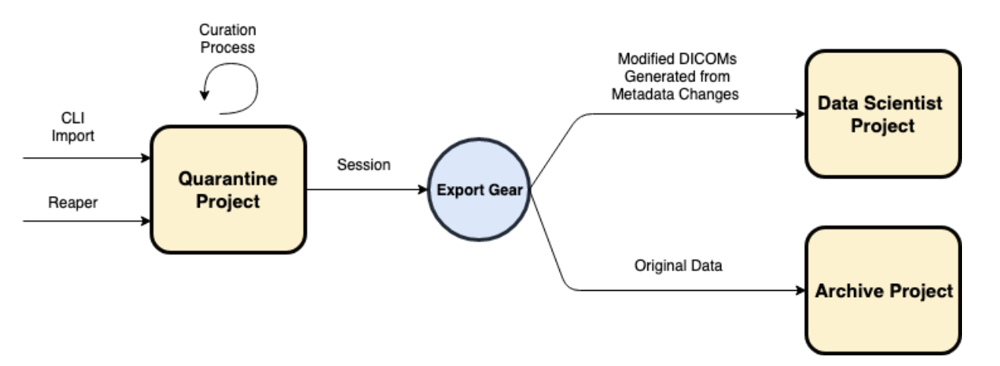

# GRP-9-session-export
Export Session data with modified metadata reflected in exported DICOM files.

Exports data (including metadata) from a given session to the specified 'export_project'. The gear will also read DICOM header information from Flywheel metadata and modify DICOM headers to reflect the changes made. Optionally, original data can be 'archived' to an <archive_project>, as configured during the gear execution. The exported, and optionally archived, session will be tagged as appropriate using the 'EXPORTED' tag. At present this gear can only be run at the session level. Output is an export log in csv format.

__Prior to running this gear, the `export_project`, and `archive_project` (if provided) must exist.__

### Future Directions and improvements
1. Track which data (at the file level) are exported and which fields are updated for a given file and write that out to a spreadsheet.
2. Support export at project level, using tags to indicate which sessions should be exported.

## The Workflow
DICOM data enters Flywheel, after which a subset of the header is extracted and saved as metadata on the file’s info key. In some situations, the header needs to be altered or corrected during the curation process before the data is distributed to other teams. Both versions of the DICOM data should exist after the curation process: the modified data distributed to/accessible by other teams as well as the original data (with controlled access).

Currently, if modifications are made to the header information via metadata changes in Flywheel, the changes do not persist to the DICOM data itself. Users would like a way to conveniently modify the header and have it persist on downloads.  

## Export Gear Proposal

1. DICOM data enters the system and is placed in the Quarantine Project

    a. Some DICOM headers and file/path naming conventions are used to set or match fields in Flywheel, including Subject, Session and Acquisition labels

2. DICOM header metadata is saved to the file via gear

3. Other curation and validation steps occur as needed via curation gear

4. The DICOM header metadata is modified in Flywheel through the UI or SDK clients via info

    a. !! This does not modify the DICOM file data itself

5. When a session (or set of sessions) is ready to be consumed by other team members, a user can use the proposed Export Gear to transition the session

6. The Export Gear will read DICOM header information from Flywheel metadata and generate new DICOMs that reflect the changes made

    a. In this initial design, this can only make changes that were made to file.info.header.dicom

    b. Other fields can be applied to the DICOM header if they correlate to a Flywheel field

      i. For Example subject.label -> PatientId

7. The Export Gear will copy over any data from the Quarantine Project, including the modified DICOMs, and save them to the destination project to be accessed by users (in this example, a Data Science team)

8. As part of the proposed Export Gear workflow, the original DICOM data (any relevant other files) can be moved to an Archival project (or remain in quarantine?) where they can remain as a reference for future need.

    a. No changes will be made to these DICOMs

      b. Access to the Archive project can be managed via permissions

9. Optionally, this will move the session from the Quarantine Project to enable a 	queue-like workflow.

## Related Roadmap Work

### File Versioning
Files stored in Flywheel should be stored with versioning information as well as the ability to access and revive past versions. This would allow a user to update the file metadata and the file data itself in place without losing history or original data.  May also need to provide finer grained access control and permissioning on prior file versions.

### Bulk Editing of Metadata
It should be a simple action to modify metadata on sets of files and the hierarchy from the UI and SDK clients. Selecting multiple files, acquisitions, etc to modify in one action or making modifications that push up the hierarchy, down the hierarchy or into files should be possible.

## Implementation details
* In each of the target projects, we can check for the existence of a given subject, however we cannot check for the existence of a given session - this is because session labels are not required to be unique.
